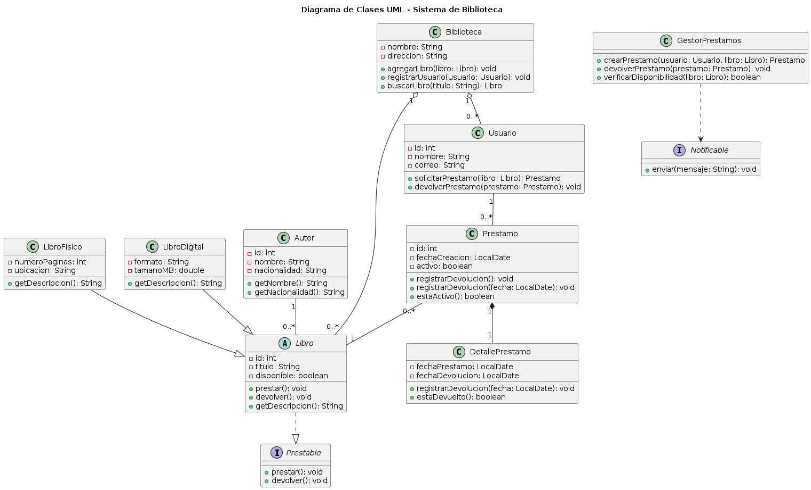

# EA1_DiagramaClases_Grupo4
SantigoSanchez

Diagrama de Clases UML del Sistema de Biblioteca grupo 4

Imagen del diagrama realizado en PlantUML
main

Evidencia de Aprendizaje 1 - Diagrama de Clases UML del Sistema de Biblioteca
Programación Orientada a Objetos 2

 SantigoSanchez
## Grupo 4

Este repositorio contiene la evidencia del trabajo colaborativo del grupo sobre el diseño de clases del sistema de biblioteca.

## Documento colaborativo

[Documento colaborativo del Grupo 4](https://docs.google.com/document/d/1J6-XcQ_R1F7sWz5lQIi1x7Zw9vqACkhe/edit?usp=sharing&ouid=110130008599282704927&rtpof=true&sd=true&authuser=1)

## Descripción del proyecto

Se desarrolló un diagrama de clases UML para representar las entidades principales de un sistema de biblioteca, incluyendo usuarios, libros, préstamos, empleados y relaciones entre ellos.

## Objetivo

Documentar y comunicar la estructura del sistema utilizando el enfoque de programación orientada a objetos.

## Descripción

Este repositorio contiene la evidencia del trabajo colaborativo del Grupo 4 para el diseño de clases UML de un sistema de biblioteca. En el proyecto se representan las entidades principales del sistema, sus atributos, métodos y las relaciones entre ellas, aplicando los conceptos de programación orientada a objetos.

## Objetivo

Documentar y comunicar la estructura del sistema de biblioteca mediante un diagrama de clases que permita comprender mejor su funcionamiento y organización.

## Documento colaborativo

[Documento colaborativo del Grupo 4 link ](https://docs.google.com/document/d/1J6-XcQ_R1F7sWz5lQIi1x7Zw9vqACkhe/edit?usp=sharing&ouid=110130008599282704927&rtpof=true&sd=true&authuser=1)

## Archivo relacionado

[Documento PDF de la evidencia](https://github.com/user-attachments/files/31604648/EA1_DiagramaClases_Grupo4.docx.pdf)

main
main
